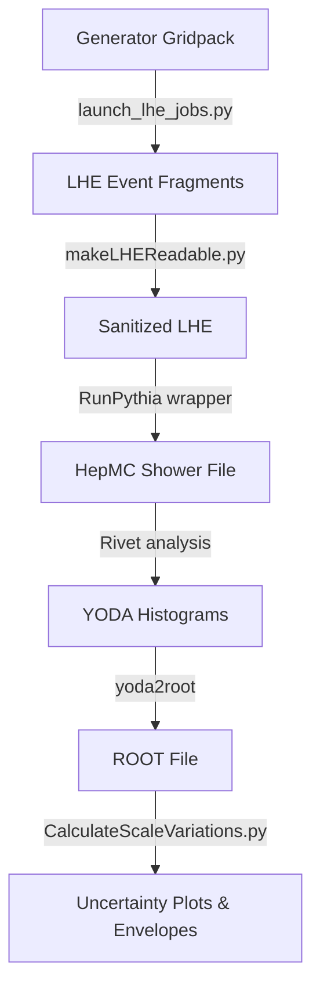

# STXS Stage 1.3 Uncertainty

This project provides a comprehensive workflow to evaluate systematic QCD scale uncertainties for **VH (Vector Boson + Higgs)** production processes using the **Simplified Template Cross Sections (STXS)** framework.

The workflow calculates QCD scale uncertainties by evaluating cross-section migrations across kinematic boundaries using the **Stewart-Tackmann prescription**. The entire computing pipeline has been automated and migrated to **EL9 (Enterprise Linux 9)** and **`CMSSW_13_3_3`** (utilizing Python 3).

<div class="grid cards" markdown>

-   :octicons-log-16: **[Daily Log](daily-log.md)**

    ---

    Day-to-day progress logs, journals, and development notes.

-   :octicons-people-16: **[Meetings](meetings.md)**

    ---

    Meeting logs, agendas, and action items.

-   :octicons-book-16: **[Wiki & Guides](wiki.md)**

    ---

    Technical recipes, environment configurations, and tools.

-   :octicons-link-16: **[Resources & Links](resources.md)**

    ---

    Links to kickoff slides, GitLab code repositories, and plots.

</div>

---

## 1. Physics Principles & Stewart-Tackmann Prescription

In Higgs physics, measurements are performed in exclusive kinematic bins (STXS) to minimize model dependence. However, varying the perturbative QCD scales (μ_R and μ_F) shifts the event kinematics, causing cross-sections to "migrate" across bin boundaries.

### The Problem: Naive Scale Variation
Naively varying the QCD scale independently within each exclusive bin results in a cumulative uncertainty that grows as √N_bins, far exceeding the known inclusive cross-section uncertainty. Furthermore, because events migrating out of one bin must migrate into the adjacent bin, bin uncertainties are highly correlated.

### The Solution: Stewart-Tackmann Method
The Stewart-Tackmann prescription avoids double-counting by decomposing the total uncertainty into two uncorrelated physical sources:
1.  **Inclusive Yield Uncertainty (Δ_Y)**: The uncertainty on the overall cross-section above a threshold (derived from higher-order QCD calculations).
2.  **Migration Uncertainty (Δ_cut)**: The uncertainty on how events redistribute across a specific kinematic boundary (driven by the scale-sensitivity of the cut region).

Because these sources are orthogonal, they are summed in quadrature to yield the total uncertainty for each bin.

### Anti-Correlation by Construction
To conserve the total cross-section, the migration uncertainty across a boundary acts with opposite signs on adjacent bins:
*   **Bin below the cut**: Loses events &rarr; -Δ_cut
*   **Bin above the cut**: Gains events &rarr; +Δ_cut

---

## 2. Kinematic Slices

The analysis processes scale variations in both 1D and 2D planes:

### A. 1D Variations: pT(V) Slices
The STXS Stage 1.1 definition for VH production slices the vector boson transverse momentum pT(V) into 5 bins. **Stage 1.3** upgrades this by dividing the tail (>400 GeV) into two components:
1.  `0 - 75 GeV`
2.  `75 - 150 GeV`
3.  `150 - 250 GeV`
4.  `250 - 400 GeV`
5.  `400 - 600 GeV` *(Stage 1.3 Upgrade)*
6.  `> 600 GeV` *(Stage 1.3 Upgrade)*

#### Boundary Migration Mapping (Stage 1.3)
Each bin is subject to the inclusive uncertainty (Δ_Y) and the boundaries it touches. The total uncertainty for a bin is the sum in quadrature of all applicable components:

| Bin | Lower Bound | Upper Bound | Bounding Sources | Total Uncertainty Formula |
|:---|:---:|:---:|:---|:---|
| **0-75 GeV** | - | 75 | Δ_Y, -Δ_75 | √ ( Δ_Y² + Δ_75² ) |
| **75-150 GeV** | 75 | 150 | Δ_Y, +Δ_75, -Δ_150 | √ ( Δ_Y² + Δ_75² + Δ_150² ) |
| **150-250 GeV** | 150 | 250 | Δ_Y, +Δ_150, -Δ_250 | √ ( Δ_Y² + Δ_150² + Δ_250² ) |
| **250-400 GeV** | 250 | 400 | Δ_Y, +Δ_250, -Δ_400 | √ ( Δ_Y² + Δ_250² + Δ_400² ) |
| **400-600 GeV** | 400 | 600 | Δ_Y, +Δ_400, -Δ_600 | √ ( Δ_Y² + Δ_400² + Δ_600² ) |
| **>600 GeV** | 600 | - | Δ_Y, +Δ_600 | √ ( Δ_Y² + Δ_600² ) |

### B. 2D Variations: pT(V) x N_jets Slices
Within each pT(V) slice, events are further categorized by jet multiplicity:
*   `0-jets` (0J)
*   `1-jet` (1J)
*   `>= 2-jets` (>= 2J)

This introduces jet-migration uncertainties:
*   **Δ_1**: Migration across the 0J <-> 1J boundary.
*   **Δ_2**: Migration across the 1J <-> >= 2J boundary.

The total 2D uncertainty for a sub-bin is calculated as:

**Total_2D = √ ( Δ_pT² + Δ_1² + Δ_2² )**

---

## 3. End-to-End Workflow

The workflow converts parton-level Monte Carlo inputs into finalized QCD scale uncertainty distributions.



1.  **LHE Generation**: Generates parton-level event samples from gridpacks (locally or via HTCondor).
2.  **Preprocessing**: Sanitizes LHE files (`makeLHEReadable.py`) to conform with Pythia's input parser.
3.  **Parton Showering**: Runs the compiled C++ wrapper `RunPythia` to shower events and apply theoretical scale weights.
4.  **STXS Classification**: Passes showered HepMC events to `Rivet` using the `HiggsTemplateCrossSections` analysis plugin to bin events into STXS categories.
5.  **Post-Processing & Plotting**: Converts YODA histograms to ROOT and runs the calculation scripts to output systematic parameter cards and plots.

---

## 4. Code Logic Reference

The central calculation logic is implemented in the python helper script `stxs_uncertainty_logic.py`:

```python
def compute_boundary_delta(boundary_idx, current_bin, npTBins, r_factor, max_dev_values, central_values):
    """Return the migration component for one pT boundary."""
    if current_bin < boundary_idx:
        return 0.0
    if current_bin == boundary_idx:
        denom = central_values[current_bin - 1]
        scale = r_factor if boundary_idx >= 2 else 1.0
        return -scale * boundary_error / denom
    denom = sum(central_values[boundary_idx:])
    scale = r_factor if boundary_idx >= 2 else 1.0
    return scale * boundary_error / denom
```

*   If the bin is below the boundary cut, the migration has no impact ($0.0$).
*   If the bin is exactly at the boundary cut, it loses events ($-\Delta$).
*   If the bin is above the boundary cut, it receives migrated events ($+\Delta$) normalized against the sum of the remaining tail.

---

## 5. Usage Commands Reference

### Environment Setup
Run the setup script to load `CMSSW_13_3_3`, compilers, and Rivet paths:
```bash
# Usage: source setup_env.sh [MODE] [ENERGY] [STAGE]
source setup_env.sh QQ2ZH 13p6 stage1p3
```

### Running the Showering & Classification Pipeline
To run LHE sanitization, Pythia showering, Rivet analysis, and ROOT conversion end-to-end:
```bash
python3 launch_jobs.py \
  --inputnames cmsgrid_final_merged \
  --infilepath ../GEN \
  --outfilepath . \
  --step all \
  --mode QQ2ZH --energy 13p6 --stage stage1p3
```

### Batch Submission (HTCondor)
For heavy jobs, submit to HTCondor with specific configuration flags:
```bash
python3 launch_jobs.py \
  --step all \
  --inputnames cmsgrid_final_merged \
  --infilepath ../GEN \
  --outfilepath . \
  --job-mode condor \
  --mode QQ2ZH --energy 13p6 --stage stage1p3 \
  --sub-opts '+JobFlavour="workday"'
```

### Scale Variation and Plotting Calculations
Once you have the `-mod.root` file, run the calculations to produce the final systematic plots:
```bash
# Calculate and plot 1D inclusive pT uncertainties
python3 CalculateScaleVariations.py cmsgrid_final-mod --mode QQ2ZH --energy 13p6 --stage stage1p3

# Calculate and plot 2D pT x Jet uncertainties
python3 CalculateScaleVariations2D.py cmsgrid_final-mod --mode QQ2ZH --energy 13p6 --stage stage1p3
```
These scripts output the following plots:
*   `pTBinsUnc_central.pdf`: 1D boundary migration envelopes.
*   `pTBinsJetsUnc_central.pdf`: 2D momentum + jet multiplicity migration envelopes.
*   `XsectionpTJetsBinsUnc_powheg.pdf`: Absolute cross-section yields under scale variations.
*   `XsectionpTJetsBinsUnc_powheg_Relative.pdf`: Relative fractional envelope.
